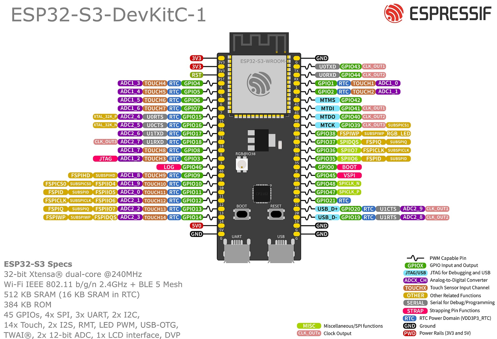

# Let's try something a little bit different - Yoav

# OpenPad. Universal ESP32 Controller
> An open-source, multi-platform game controller built on the ESP32-S3.  
> One device. USB-C or Bluetooth. PC, Switch, Wii, Android, Mac, Steam Deck - and more.

## Important:
Recommended to use PlatformIO if you want convenience, Arduino IDE also works.
This project Base uses the ESP32-S3-DevKitC-1. Reference here: 

## What Is OpenPad?
OpenPad is a fully open-source game controller designed around the **ESP32-S3** microcontroller. It supports multiple output platforms over both **USB-C** and **Bluetooth**, with on-boot mode selection and a built-in motion sensor for Wii compatibility.
The goal is a single controller you can use for everything with full open access to the firmware and PCB design so anyone can build, modify, and improve it.

## License

MIT License - do whatever you want, just keep the attribution.

PCB design files are additionally licensed under CERN Open Hardware License v2.

## Acknowledgements

Inspired by and building on the work of:
- [BlueRetro](https://github.com/darthcloud/BlueRetro) - open source BT adapter for retro consoles
- [ESP32-BLE-Gamepad](https://github.com/lemmingDev/ESP32-BLE-Gamepad)
- The wider ESP32 open hardware community

OpenPad is an independent open source project. It is not affiliated with, endorsed by, or connected to Nintendo, Sony, Microsoft, or any console manufacturer. Protocol implementations are based on publicly available reverse-engineering research and are intended for personal, educational, and interoperability use.
Selling assembled units or kits does not require a license, but CE/FCC certification may be required depending on your jurisdiction and sales volume. As a kit (unassembled), regulatory requirements are significantly reduced in most regions.